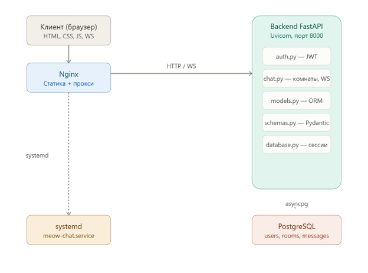
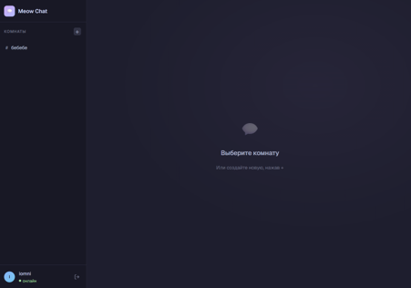

# Meow Chat — документация

**Разделы документации:**
[Главная](index.md) |
[Быстрый старт](quick-start.md) |
[Установка и настройка](installation.md) |
[Руководство пользователя](user-guide.md) |
[Справочная информация](reference.md)

---

**Meow Chat** — веб-приложение для обмена текстовыми сообщениями в реальном времени. Пользователи регистрируются, создают тематические комнаты и общаются в них через браузер. Сообщения доставляются мгновенно по протоколу WebSocket.

Версия программы: **1.0.0**.

## Назначение

Эта документация предназначена для разработчика или администратора, который разворачивает Meow Chat на своём компьютере или сервере и дорабатывает проект. Она помогает запустить приложение, настроить его для работы в продуктивной среде и найти технические сведения об API.

Для обычных пользователей чата подготовлена отдельная короткая страница — [Руководство пользователя](user-guide.md).

## Основные возможности

- регистрация и вход по логину и паролю (JWT-аутентификация);
- создание и удаление тематических комнат;
- обмен сообщениями в реальном времени через WebSocket;
- хранение и просмотр истории сообщений комнаты;
- системные уведомления о входе и выходе участников;
- мгновенное обновление списка комнат у всех пользователей;
- REST API и автоматическая документация Swagger (`/docs`).

## Состав комплекса

Приложение состоит из четырёх частей:

1. **Клиент** — статические страницы `login.html`, `register.html`, `chat.html` и скрипты (HTML, CSS, JavaScript без фреймворков).
2. **Nginx** — раздаёт статику и проксирует HTTP- и WebSocket-запросы на бэкенд.
3. **Бэкенд** — Python, FastAPI, Uvicorn.
4. **PostgreSQL** — хранит пользователей, комнаты и сообщения.

*Рисунок 1 — Архитектура Meow Chat.*

## Технологии

| Уровень | Технологии |
|---|---|
| Бэкенд | Python 3.11+, FastAPI, SQLAlchemy (async), asyncpg, Uvicorn |
| Аутентификация | JWT (python-jose), bcrypt |
| База данных | PostgreSQL |
| Клиент | HTML, CSS, JavaScript, WebSocket API |
| Сервер | Ubuntu Server, Nginx, systemd |

## Интерфейс программы

*Рисунок 2 — Главное окно чата.*

## С чего начать

| Ваша задача | Раздел |
|---|---|
| Быстро запустить чат на своём компьютере | [Быстрый старт](quick-start.md) |
| Развернуть чат на сервере | [Установка и настройка](installation.md) |
| Научиться пользоваться чатом | [Руководство пользователя](user-guide.md) |
| Найти эндпоинт, параметр или код ошибки | [Справочная информация](reference.md) |

> **Примечание:** документация описывает версию 1.0.0. Если вы меняете исходный код, обновляйте и документацию.
