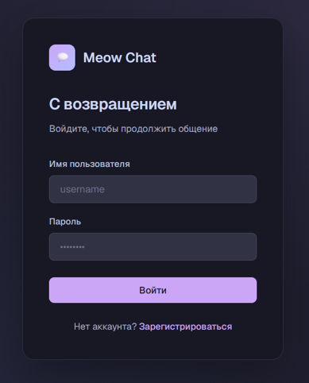

# Быстрый старт

**Разделы документации:**
[Главная](index.md) |
[Быстрый старт](quick-start.md) |
[Установка и настройка](installation.md) |
[Руководство пользователя](user-guide.md) |
[Справочная информация](reference.md)

---

Этот раздел поможет запустить Meow Chat на локальном компьютере за 5–10 минут. Если нужна установка на сервер, перейдите к разделу [Установка и настройка](installation.md).

## Что понадобится

- Python 3.11 или новее;
- PostgreSQL (запущенный сервер и доступ к пользователю `postgres`);
- Git;
- современный браузер (Chrome, Edge или Firefox).

## Шаги запуска

1. Клонируйте репозиторий:

```bash
   git clone https://github.com/aelithal/meow-chat.git
   cd meow-chat
```

2. Создайте виртуальное окружение и установите зависимости:

```bash
   python -m venv venv
   source venv/bin/activate        # Windows: venv\Scripts\activate
   pip install -r requirements.txt
```

3. Создайте базу данных:

```bash
   sudo -u postgres psql -c "CREATE DATABASE chatdb;"
```

   Таблицы создаются автоматически при первом запуске бэкенда.

4. Подготовьте файл настроек:

```bash
   cd backend
   cp .env.example .env
```

   Откройте `.env` и заполните `DATABASE_URL` и `SECRET_KEY`. Ключ можно сгенерировать командой:

```bash
   python -c "import secrets; print(secrets.token_hex(32))"
```

   Подробнее о параметрах — в разделе [Установка и настройка](installation.md#параметры-настройки-env).

5. Запустите бэкенд:

```bash
   uvicorn main:app --reload
```

6. Запустите фронтенд:
   - **Chrome и Edge:** откройте файл `frontend/login.html` в браузере.
   - **Firefox:** `localStorage` для `file://` ограничен, поэтому запустите локальный сервер:

```bash
     cd ../frontend
     python -m http.server 5500
```

     Затем откройте `http://localhost:5500/login.html`.

## Что вы должны увидеть

- Команда `uvicorn` выводит строку `Uvicorn running on http://127.0.0.1:8000`.
- Адрес `http://localhost:8000/health` возвращает `{"status":"ok"}`.
- Адрес `http://localhost:8000/docs` открывает Swagger UI.
- В браузере открывается страница входа.



*Рисунок 1 — Страница входа.*

## Первая проверка

1. Нажмите «Зарегистрироваться» и создайте пользователя (имя 3–50 символов, только буквы и цифры; пароль от 6 символов).
2. Войдите под созданным именем.
3. Создайте комнату кнопкой «+» и отправьте сообщение.

Подробное описание действий — в [Руководстве пользователя](user-guide.md).

> **Важно:** по умолчанию клиентские скрипты обращаются к `localhost:8000`. Для сервера адреса нужно изменить, это описано в [Установке и настройке](installation.md#адреса-бэкенда-в-клиентских-скриптах).

## Если что-то не работает

| Симптом | Что проверить |
|---|---|
| Страница входа открывается, но вход не работает | Запущен ли `uvicorn`, отвечает ли `/health` |
| Ошибка подключения к БД в консоли `uvicorn` | Значение `DATABASE_URL` в `.env`, запущен ли PostgreSQL |
| Ошибки подписи токена | Заполнен ли `SECRET_KEY` в `.env` |
| В Firefox не сохраняется вход | Запустите фронтенд через `python -m http.server` |

Коды и тексты сообщений приведены в [Справочной информации](reference.md#сообщения-об-ошибках).

[← Вернуться на главную страницу](index.md)
