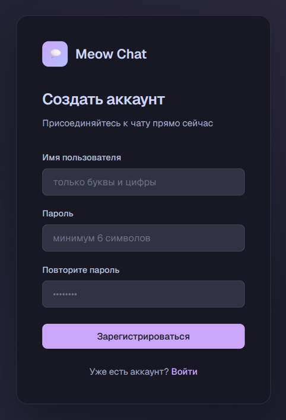
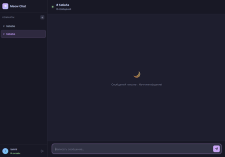

# Руководство пользователя

**Разделы документации:**
[Главная](index.md) |
[Быстрый старт](quick-start.md) |
[Установка и настройка](installation.md) |
[Руководство пользователя](user-guide.md) |
[Справочная информация](reference.md)

---

Раздел описывает основные действия пользователя в Meow Chat: регистрацию, вход, создание комнат, обмен сообщениями и выход. Установка на устройство не требуется, достаточно браузера и адреса сервера (например, `http://meow-chat.net`).

Если вы развернули чат самостоятельно, сначала выполните [Установку и настройку](installation.md).

## Требования

- Chrome, Edge или Firefox актуальной версии;
- включённые JavaScript и `localStorage`;
- доступ к сети и экран не менее 1280×720 (на телефоне интерфейс адаптируется, список комнат открывается кнопкой меню).

## Регистрация

1. Откройте адрес чата. Откроется страница входа.
2. Нажмите ссылку **«Зарегистрироваться»**.
3. Введите имя пользователя и пароль, повторите пароль.
4. Нажмите **«Зарегистрироваться»**.

После успешной регистрации вы будете автоматически перенаправлены на страницу входа.

| Поле | Требования |
|---|---|
| Имя пользователя | от 3 до 50 символов, только буквы и цифры |
| Пароль | не менее 6 символов |

*Рисунок 1 — Страница регистрации.*

## Вход в систему

1. Введите имя пользователя и пароль.
2. Нажмите **«Войти»** или клавишу Enter.

Откроется главное окно чата со списком комнат. Сеанс действует ограниченное время (по умолчанию 60 минут). После истечения срока нужно войти снова.

## Создание комнаты

1. Нажмите **«+»** рядом с заголовком «Комнаты».
2. Введите название (от 2 до 100 символов).
3. Нажмите **«Создать»**.

Комната появится в списке у всех пользователей, а вы автоматически в неё войдёте.

*Рисунок 2 — Окно чата после создания комнаты.*

## Отправка сообщений

1. Выберите комнату в списке слева.
2. Введите текст в поле внизу экрана.
3. Нажмите кнопку отправки или клавишу **Enter**. Для переноса строки используйте **Shift + Enter**.

Сообщение сразу появится у всех участников комнаты. При входе в комнату загружаются последние 50 сообщений. Когда кто-то входит в комнату или покидает её, в ленте появляется системное уведомление.

## Удаление комнаты

1. Наведите курсор на комнату в списке и нажмите значок корзины.
2. Подтвердите удаление.

> **Внимание:** вместе с комнатой безвозвратно удаляются все сообщения в ней. Любой пользователь может удалить любую комнату, поэтому действуйте осторожно.

## Выход

Нажмите значок выхода рядом с вашим именем в левом нижнем углу. Сеанс завершится, и вы вернётесь на страницу входа.

## Сообщения об ошибках

| Сообщение | Причина | Что делать |
|---|---|---|
| Минимум 3 символа / Максимум 50 символов / Только буквы и цифры | Имя не соответствует формату | Исправьте имя пользователя |
| Минимум 6 символов | Слишком короткий пароль | Введите пароль от 6 символов |
| Пароли не совпадают | Повтор пароля отличается | Введите пароль повторно |
| Пользователь с таким именем уже существует | Имя занято | Выберите другое имя |
| Неверное имя пользователя или пароль | Неверные данные входа | Проверьте ввод и повторите |
| Комната с таким именем уже существует | Название занято | Выберите другое название или войдите в существующую комнату |
| Комната не найдена | Комната удалена | Обновите список комнат |
| Неверный или истёкший токен | Сеанс закончился | Войдите в систему заново |
| Соединение потеряно | Нет связи с сервером | Подождите: чат переподключается автоматически. Если не помогло, обновите страницу |

Технические подробности об ошибках — в [Справочной информации](reference.md#сообщения-об-ошибках).

[← Вернуться на главную страницу](index.md) | Далее: [Справочная информация](reference.md)
